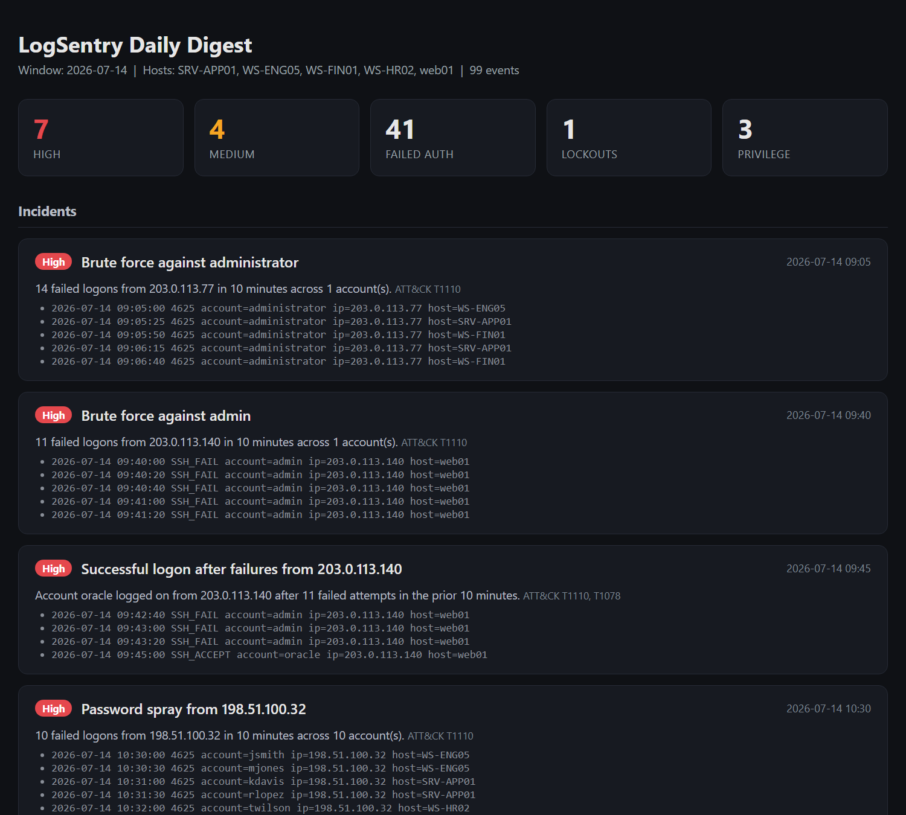
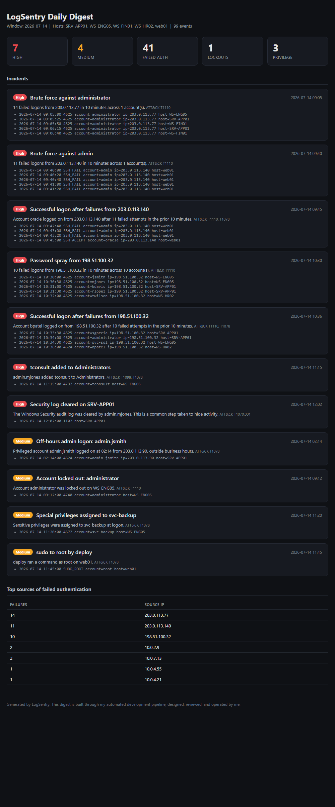
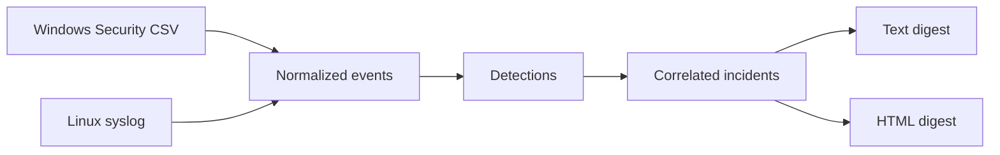

# LogSentry

Turns Windows and Linux security logs into a short daily digest with correlated incidents.




## The problem

The signal is already in the logs. Failed logons, account lockouts, and privilege grants get written the moment they happen. The problem is that nobody reads them. They sit in the Windows Security log and in syslog until an incident forces someone to go looking, and by then the early signal is buried under thousands of routine lines.

LogSentry reads those logs and writes one page. It surfaces the events that matter and correlates them into incidents.

## What it does

- Parses Windows Security events exported to CSV and Linux auth logs in syslog format.
- Normalizes both into one event shape, so every detection runs the same way against either source.
- Correlates events into incidents. Brute force, password spray, a success right after a burst of failures, lockouts, privilege grants, log clearing, and off-hours admin logons.
- Writes a digest as plain text for a terminal or a cron mail, and as a self-contained HTML page.
- Maps every detection to a MITRE ATT&CK technique.

## Screenshots

The digest opens with a summary, then lists incidents worst first, each with the evidence lines behind it.



## Architecture



The parsers are the only part that knows about log formats. Everything after the normalized event is source-agnostic. That is why the same brute-force rule catches a Windows 4625 storm and an sshd failure storm without any special casing.

## Quick start

Demo mode needs no logs and no host. It runs anywhere in seconds.

```bash
pip install -e .
logsentry --demo --out digest.html
```

That prints a text summary and writes an HTML digest you can open in any browser. The demo corpus is synthetic and every line in it is fake.

## Usage

Against real logs:

```bash
# Windows, after exporting events with the bundled helper
logsentry --windows-csv security-events.csv --out digest.html

# Linux
logsentry --syslog /var/log/auth.log --out digest.html

# Both at once
logsentry --windows-csv security-events.csv --syslog /var/log/auth.log --out digest.html
```

To collect the Windows CSV from a host you administer, run the included helper. It is read-only.

```powershell
.\tools\Export-SecurityEvents.ps1 -Hours 24 -OutputPath security-events.csv
```

## Detections

| ID | What it catches | ATT&CK |
|----|-----------------|--------|
| BRUTE-FORCE | Many failed logons from one source in a short window | T1110 |
| SPRAY-SUCCESS | A successful logon right after a burst of failures from the same source | T1110, T1078 |
| LOCKOUT | Account lockout | T1110 |
| PRIV-GRANT | Added to a privileged group, special privileges assigned, or sudo to root | T1098, T1078 |
| LOG-CLEARED | The Windows Security audit log was cleared | T1070.001 |
| OFF-HOURS-ADMIN | A successful privileged logon outside business hours | T1078 |

## How it works

The interesting detections are the correlated ones.

**Brute force** groups failed logons by source, then slides a time window across each source's failures and takes the densest burst. If that burst crosses the threshold, it is an incident. Grouping by source is what separates one attacker hammering a host from forty users each mistyping a password once. When the same burst spans three or more accounts, LogSentry calls it a password spray instead, because that is the shape spraying makes.

**Success after failures** is the one that matters most. A burst of failures is noise until one of them succeeds. LogSentry watches each source for a successful logon that lands right after a run of failures and raises it as High. That is the difference between a blocked attack and a breach.

**Log clearing** is included because clearing the Security log is one of the first things an intruder does to cover tracks. A single 1102 is worth a High on its own.

The digest reports on the date range present in the data, not on the wall clock. Feed it yesterday's logs and it summarizes yesterday.

## Demo data

The demo corpus is generated by `demo/generate_demo.py`. Every line is fake. Dates are fixed so the digest output is stable no matter when you run it. The corpus seeds routine activity plus one of each incident so a reviewer sees every detection fire.

## Roadmap

- Ingest Windows events directly from EVTX so no export step is needed.
- Add a JSON output for feeding a SIEM or a ticketing system.
- Add a watch mode that runs on a schedule and mails the digest.
- Add more syslog sources beyond sshd and sudo.

## What I learned

The design decision that paid off was putting all format knowledge in the parsers and nowhere else. Once every log became the same event, the detections got simple and I could test them against a handful of handmade events with no files involved. The brute-force window was the part I got wrong first. My first version counted all failures from a source over the whole day, which flagged slow background noise. Sliding a real time window fixed it and matched how the attack actually looks.

## Notes on this portfolio

Projects in this portfolio are built through my automated development pipeline. I design them, review the output, and operate the system that ships them. The pipeline itself is the final project in the set.

## License

MIT. See [LICENSE](LICENSE).
